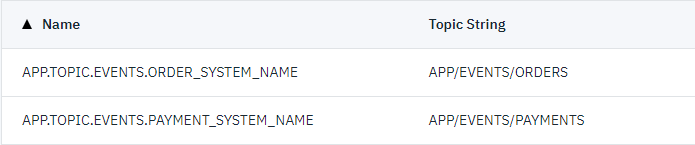

# Examples

## Reconnect JMS Listener
Avoid connection los on network hickups or any JMS server re-start:

- https://sterl.org/2020/04/reconnecting-jms-listener/
- [Test Class](src/test/java/org/sterl/training/jms/ibm/IbmReconnectExampleTest.java)

## Event Sroucing & Audit Service with JMS

Topic Strings used for a simple attach of an audit service.

- [Test Class](src/test/java/org/sterl/training/jms/ibm/IbmSubscriptionStringExampleTest.java)

# Useful link for JMS

- Get a free IBM MQ Server: https://cloud.ibm.com/ 
- IBM MQ classes for Spring https://github.com/ibm-messaging/mq-jms-spring
- IBM tutorial https://developer.ibm.com/technologies/java/tutorials/mq-jms-application-development-with-spring-boot/
- Spring Boot JMS https://spring.io/guides/gs/messaging-jms/
